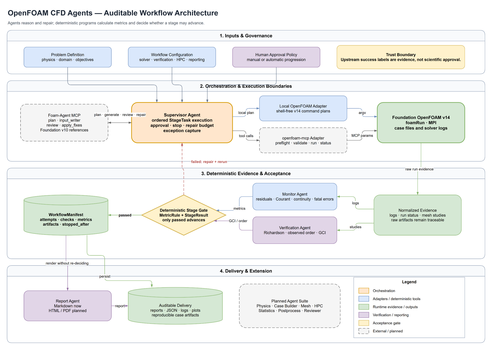

# OpenFOAM CFD Agents

An auditable, reproducible multi-agent workflow for the full lifecycle of OpenFOAM CFD cases. The current runtime profile targets **Foundation OpenFOAM v14**. Ports and adapters keep the core open to SU2, Fluent, STAR-CCM+, schedulers, and external agent systems.

> The project is an early Phase 1 MVP. It provides a deterministic control plane and integration boundaries; it does not yet provide unattended natural-language modeling or a complete production CFD lifecycle.

## Core principles

- Agents propose, explain, and repair. Deterministic programs calculate metrics and decide stage status.
- Every stage emits a canonical `StageResult`. Only `passed` may advance the workflow.
- A solver process exiting successfully is not evidence that its result is scientifically credible.
- OpenFOAM assumptions are explicit. The local adapter currently accepts `foundation-14` and uses `foamRun`.
- External systems remain behind adapters, so their version assumptions and success semantics cannot leak into the core.
- Inputs, attempts, checks, logs, metrics, and artifacts remain traceable through a `WorkflowManifest`.

## Implemented MVP

| Component | Current capability |
| --- | --- |
| Supervisor Agent | Ordered execution, deterministic stop gates, explicit human approval, bounded repair attempts, exception capture, and manifest persistence |
| Monitor Agent | Parses time steps, residuals, Courant number, continuity error, and fatal errors; evaluates configured limits |
| Verification Agent | Three-grid Richardson extrapolation, observed order, GCI, and recommended mesh level |
| Report Agent | Renders the already-decided manifest to Markdown without reinterpreting status |
| Local OpenFOAM Adapter | Foundation v14 preflight, shell-free serial/parallel `foamRun` plans, execution, and per-command logs |
| Foam-Agent MCP Adapter | Maps planning, case generation, execution, review, repair, and visualization to Foam-Agent's real `request` contracts |
| openfoam-mcp Adapter | Maps preflight, case validation, serial/parallel execution, and status queries to its real `params` contracts |
| CLI | Configuration validation, log monitoring, mesh verification, run-plan generation, and report rendering |

Not yet implemented: production Physics, Case Builder, Mesh, HPC, Statistics, Postprocess, and independent Reviewer agents; an LLM provider; live automatic solver termination; SLURM/PBS; HTML/PDF reports; and a complete Foundation v14 template library.

## Architecture



[Editable draw.io source](docs/diagrams/openfoam-cfd-agents-architecture.drawio) · [Editable SVG export](docs/diagrams/openfoam-cfd-agents-architecture.drawio.svg)

Foam-Agent supplies a reasoning-oriented planning and repair boundary. openfoam-mcp supplies an execution-oriented tool boundary. Neither upstream project's own success label is accepted as scientific approval: evidence must be normalized and evaluated by this project's deterministic gates.

See [Architecture](docs/ARCHITECTURE.md) and [Upstream study](docs/UPSTREAM_STUDY.md) for the detailed design and the exact upstream revisions reviewed.

## Quick start

PowerShell 7:

```powershell
git clone https://github.com/hamletroyophelia/openfoam-cfd-agents.git
Set-Location -LiteralPath '.\openfoam-cfd-agents'
py -3.12 -m venv .venv
& .\.venv\Scripts\Activate.ps1
python -m pip install -e '.[dev]'
python -m pytest
```

Run the deterministic tools:

```powershell
cfd-workflow validate-config .\config\default.yaml
cfd-workflow monitor .\examples\phase1\log.foamRun --output .\runs\demo\monitor.json
cfd-workflow verify-mesh .\examples\phase1\mesh-study.yaml --output .\runs\demo\mesh-verification.json
cfd-workflow plan-run 'D:\cases\case with spaces' --processes 16 --output .\runs\demo\run-plan.json
```

Before actual OpenFOAM execution, the host must load Foundation v14 so that `WM_PROJECT_DIR`, `WM_PROJECT_VERSION=14`, `foamRun`, `blockMesh`, and `checkMesh` are available. Windows can run the analysis, verification, and reporting tools. Solving normally runs on a configured Linux host, container, or HPC node.

## Machine-readable result

```json
{
  "stage": "mesh_verification",
  "status": "passed",
  "metrics": {
    "fine_gci": 0.018,
    "observed_order": 1.92,
    "recommended_level": "fine"
  },
  "checks": [],
  "artifacts": ["mesh-study.yaml"],
  "message": "All acceptance checks passed."
}
```

The status is derived from rules. An agent cannot declare itself `passed`.

## Project layout

```text
openfoam cfd agents/
├── agents/                       # Agent responsibilities and contracts
├── config/                       # Workflow configuration
├── docs/                         # Architecture, diagrams, and upstream study
├── examples/phase1/              # CLI smoke-test inputs
├── src/openfoam_cfd_agents/
│   ├── agents/                   # Supervisor, Monitor, Verification, Report
│   ├── adapters/openfoam/        # Local v14, Foam-Agent MCP, openfoam-mcp
│   ├── cli.py
│   ├── config.py
│   └── domain.py                 # StageResult and deterministic gates
├── tests/
├── LICENSE
└── pyproject.toml
```

## Upstream foundations

- [csml-rpi/Foam-Agent](https://github.com/csml-rpi/Foam-Agent) provides the planning, input generation, run-review-repair loop, HPC, and visualization reference. Its default validated runtime is Foundation OpenFOAM v10.
- [milsonson/openfoam-mcp](https://github.com/milsonson/openfoam-mcp) provides the execution-tool reference: 23 MCP tools, path controls, preflight states, serial fallback, job events, and artifacts.
- [Foundation OpenFOAM v14 User Guide](https://doc.cfd.direct/openfoam/user-guide-v14) is the primary authority for v14 behavior.

No upstream source code is copied into this repository. The adapters implement documented and source-verified tool boundaries.

## License

Apache License 2.0. See [LICENSE](LICENSE).
